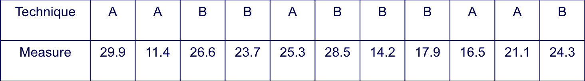
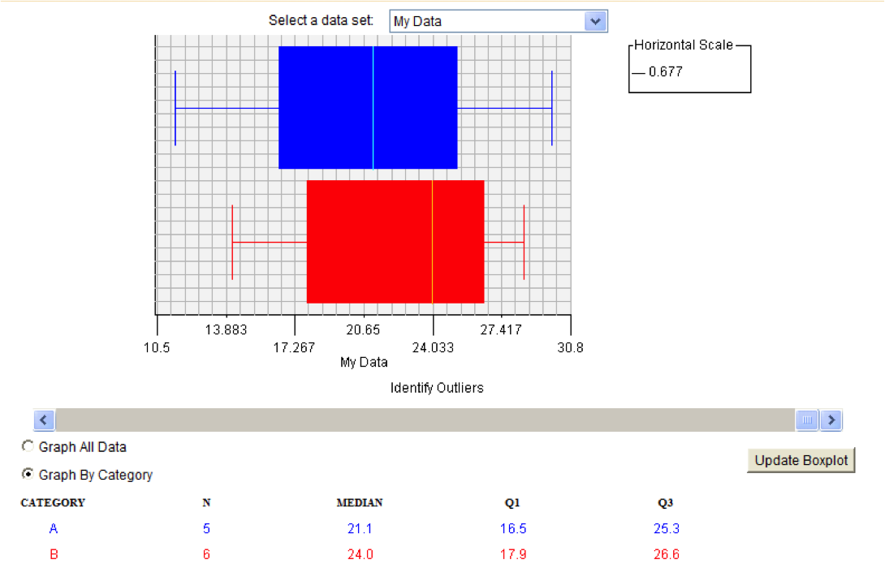

% Data Analysis 101
% Parallel experiments
% Oscar Dieste

# Goal
- Experiments don’t have to be complicated. They can be so simple as comparing a pair of techniques
-- 1 factor with 2 levels
- In cases like these, we don’t need expensive tools (SPSS, STATA, etc.) to analyze the experimental results
- We will learn how to test hypothesis using paper and pencil

# Outline
## Descriptive statistics
## Reference distributions
- Null Hypothesis
## Standard distributions (for mean differences)
- Parametric: t
- Non-parametric: Wilcoxon or Mann-Whitney
## Advanced concepts
- 2-tailed tests
- Statistical power
- Determination of sample size

# A simple experiment
## A scholar wants to know if technique A (say functional testing) is better than B (say inspection)
## He performs an experiment with some students and gets the following data (metric doesn’t matter):

# Question
## How can we decide which technique (A, B) is better?
## The most obvious option is looking at the data:
### Descriptive statistics
- Median, means
- Quartiles, variances, standard deviation
### and suitable plots
- Box plots

# Box plot

## Preliminary answer
- B looks better, but the results are quite similar. We cannot be sure
- It is likely that differences arise due to random chance
- Don’t believe it? Try to toss a coin 4 times and guess the number of heads you obtain 
## As we can see from this example, many processes have an associated probability distribution
- How can we make a decision on this case?
