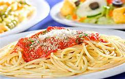

% Habits
% John Doe
% March 22, 2005

# In the morning

## Getting up

- Turn off alarm
- Get out of bed

## Breakfast

- Eat eggs
- Drink coffee

# In the evening

## Dinner

- Eat spaghetti

- Drink wine

## Going to sleep

- Get in bed
- Count sheep